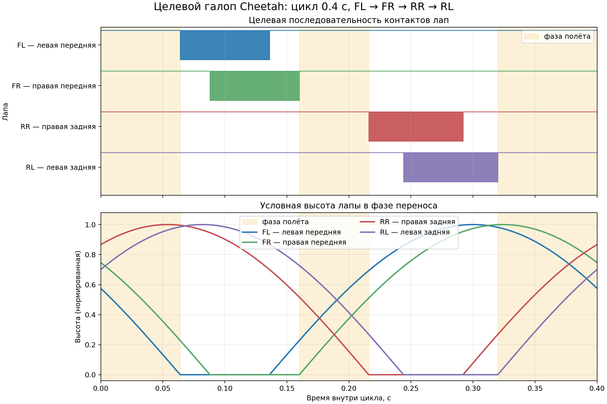

# ОБУЧЕНИЕ CHEETAH

## Цель

Робот должен:

- двигаться вперёд, постепенно повышая целевую скорость до `5 м/с`;
- ставить передние, а затем задние лапы в последовательности rotary gallop;
- иметь собранную и растянутую фазы полёта;
- создавать ускоряющий толчок задними лапами;
- использовать позвоночник при быстром беге.

## Обозначения ног

| Индекс сенсора | Лапа |
|---:|---|
| 0 | FL — левая передняя |
| 1 | FR — правая передняя |
| 2 | RL — левая задняя |
| 3 | RR — правая задняя |

## Диапазон команд скорости

```python
velocity_stages = [
  {"step": 0, "lin_vel_x": (2.2, 2.2)},
  {"step": 500 * 24, "lin_vel_x": (3.0, 3.0)},
  {"step": 1500 * 24, "lin_vel_x": (5.0, 5.0)},
]
```
Роботу задаётся только продольная скорость. Боковое движение и повороты на
текущем этапе отключены.


В этой задаче задаётся не внешняя сила, а целевая скорость, которую робот должен
научиться поддерживать приводами. Скоростной curriculum включён: обучение
начинается с `2.2 м/с`, затем переходит к `3.0 м/с` и после короткого warmup — к
финальной команде `(5, 0, 0) м/с`. Начальная скорость выше порогов включения
gallop- и spine-наград, поэтому политика сразу видит сигнал за нужную походку.

## Система наград

Итоговая награда является суммой всех компонентов:

```text
reward = Σ(weight_i · reward_i · dt)
```

Здесь `dt = 0.02 с` — длительность шага окружения. Положительный вес поощряет
поведение, отрицательный превращает значение функции в штраф, а нулевой полностью
отключает компонент. Значения `Episode_Reward/...` в TensorBoard уже учитывают
веса и масштабирование по времени.

### Сводная таблица

| Название в TensorBoard | Вес | Тип | Назначение |
|---|---:|---|---|
| `track_linear_velocity` | 5.0 | награда | Следование заданной поступательной скорости |
| `forward_velocity_progress` | 5.0 | награда | Несатурирующий сигнал за реальное продвижение вперёд |
| `track_angular_velocity` | 1.5 | награда | Следование заданной yaw-скорости без штрафа pitch/roll качки |
| `upright` | 0.3 | награда | Сохранение вертикальной ориентации передней части корпуса |
| `pose` | 0.2 | награда | Умеренное удержание суставов около исходной позы |
| `dof_pos_limits` | -1.0 | штраф | Защита от выхода за мягкие пределы суставов |
| `action_rate_l2` | -0.02 | штраф | Сглаживание резких изменений управляющего сигнала |
| `action_l2` | -0.005 | штраф | Ограничение большой амплитуды управляющего сигнала |
| `action_acc_l2` | -0.015 | штраф | Ограничение резких ускорений управляющего сигнала |
| `joint_torques_l2` | -0.003 | штраф | Ограничение больших actuator torques |
| `joint_vel_l2` | -0.0001 | штраф | Ограничение чрезмерной скорости суставов |
| `air_time` | 0.25 | награда | Поддержание разумного времени переноса отдельных лап |
| `foot_clearance` | -0.5 | штраф | Высота лапы во время движения должна быть около цели |
| `foot_swing_height` | -0.5 | штраф | Пиковая высота переноса проверяется при приземлении |
| `foot_slip` | -0.3 | штраф | Уменьшение скольжения опорных лап |
| `soft_landing` | -0.0003 | штраф | Уменьшение ударной силы при приземлении |
| `gallop_sequence` | 0.0 | отключено | Старый событийный порядок касаний |
| `clock_gallop` | 0.0 | отключено | Старый равномерный фазовый шаблон |
| `feline_gallop_contacts` | 4.0 | награда | Контакты передней пары, затем задней пары |
| `stride_length` | 5.0 | награда | Формирование достаточно длинного шага |
| `flight_phase` | 0.8 | награда | Появление фазы полёта при быстром беге |
| `extended_flight_posture` | 4.5 | награда | Растянутая поза лап в фазе полёта |
| `collected_flight_posture` | 4.5 | награда | Собранная поза лап под корпусом |
| `hind_propulsion` | 4.0 | награда | Ускоряющий толчок задними лапами |
| `spine_flexion` | 2.0 | награда | Периодическая, симметричная работа позвоночника |
| `spine_phase_tracking` | 1.5 | награда | Синхронизация позвоночника с фазой галопа |
| `stand_still` | -0.5 | штраф | Неподвижная поза при почти нулевой команде |
| `joint_acc_l2` | -2.5e-7 | штраф | Ограничение резких ускорений суставов |
| `body_ang_vel` | 0.0 | отключено | Штраф поперечной угловой скорости корпуса |
| `angular_momentum` | 0.0 | отключено | Штраф полного углового момента робота |
| `self_collisions` | -0.1 | rough only | Самостолкновения робота |
| `shank_collision` | -0.1 | rough only | Касание грунта голенью |
| `trunk_head_collision` | -0.1 | rough only | Касание грунта корпусом или головой |

### `track_linear_velocity` — следование линейной скорости

Это главный компонент задачи. Он сравнивает заданную скорость `v_cmd` с реальной
скоростью центра масс всего робота в системе координат корпуса:

```text
r = exp(-(‖v_cmd_xy - v_xy‖² + v_z²) / 2.0²)
```

Максимум равен единице при точном совпадении. Вертикальная заданная скорость
считается нулевой, поэтому сильные подпрыгивания уменьшают награду. Большой вес
`5.0` нужен, чтобы устойчивое стояние не стало выгоднее движения.

Для быстрых стадий ширина экспоненты увеличена до `2.0`. Дополнительно
`forward_velocity_progress` вычисляет `clamp(v_x / v_cmd_x, 0, 1)`. Поэтому даже
первые небольшие перемещения дают градиент, тогда как одна узкая экспонента около
нулевой скорости практически равнялась нулю.

### `track_angular_velocity` — следование угловой скорости

Команды поворота сейчас равны нулю. Для Cheetah этот компонент проверяет только
yaw-rate:

```text
r = exp(-(ωz_cmd - ωz)² / σ²)
```

Roll/pitch angular velocity не штрафуются этим компонентом. Это важно для
гибкой спины: иначе root `body_front_link` выучивает слишком ровную переднюю
половину корпуса, а gallop-качка переносится в ноги и таз.

### `upright` — ориентация корпуса

Награда сравнивает вертикаль переднего звена `body_front_link` с нормалью
поверхности. На ровной поверхности это мировая вертикаль, а на неровной — нормаль,
оцененная датчиком рельефа:

```text
r = exp(-tilt_xy² / σ²)
```

Компонент препятствует движению на боку или с чрезмерным креном. Он не контролирует
непосредственно `body_pitch_joint`, поэтому позвоночник может двигаться отдельно.

### `pose` — поза, зависящая от скорости

Награда сравнивает положения суставов с начальной позой:

```text
r = exp(-mean((q - q_default)² / σ_joint²))
```

Допустимые отклонения меняются с командой скорости:

| Режим | Hip roll | Hip pitch | Knee pitch | Spine |
|---|---:|---:|---:|---:|
| Стояние, `< 0.05 м/с` | 0.05 | 0.05 | 0.20 | 0.05 |
| Ходьба, `0.05–1.5 м/с` | 0.20 | 0.45 | 0.70 | 0.35 |
| Бег, `≥ 1.5 м/с` | 0.30 | 0.70 | 1.00 | 1.00 |

Чем больше `σ`, тем свободнее движение сустава. Малый общий вес `0.2` сохраняет
аккуратную стойку, но не должен подавлять широкий шаг и работу спины.

### `dof_pos_limits` — пределы суставов

Штраф равен суммарной величине выхода суставов за мягкие пределы. Внутри допустимой
области он равен нулю. Мягкий предел составляет 90% диапазона, заданного в MJCF.
Компонент особенно важен после увеличения action scale позвоночника.

### `action_rate_l2` — плавность управления

Штрафует изменение сырых выходов политики между соседними шагами:

```text
cost = Σ(action_t - action_(t-1))²
```

Текущий вес `-0.02` должен подавлять дрожание, но оставлять возможность быстро
переставлять ноги и сгибать позвоночник. Для борьбы с гребущим движением добавлены
дополнительные регуляризаторы: `action_l2` штрафует большую амплитуду выходов
политики, `action_acc_l2` штрафует вторую разность действий, `joint_torques_l2`
штрафует квадрат actuator torques, а `joint_vel_l2` ограничивает слишком быстрые
махи суставов.

### `air_time` — время лап в воздухе

За каждую лапу начисляется единица, пока длительность текущей воздушной фазы лежит
между `0.05` и `0.35 с`. Компонент активен только при команде движения выше
`0.5 м/с`. Он помогает отделить перенос ноги от опорной фазы, но сам по себе не
задаёт длину шага.

Метрика: `Metrics/air_time_mean`.

### `foot_clearance` — текущая высота движущихся лап

Целевая высота равна `0.092 м`. Штраф вычисляется непрерывно и сильнее действует
на быстро движущиеся лапы:

```text
cost = Σ |height - 0.092| · ‖foot_velocity_xy‖
```

Это препятствует как волочению лап, так и неоправданно высокому подъёму.

### `foot_swing_height` — пиковая высота переноса

Для каждой лапы запоминается максимальная высота с момента отрыва. В момент
следующего касания она сравнивается с целью `0.092 м`:

```text
cost = Σ (peak_height / 0.092 - 1)²
```

В отличие от `foot_clearance`, этот штраф начисляется только при приземлении.
Метрика: `Metrics/peak_height_mean`.

### `foot_slip` — скольжение лап

Для лап, находящихся в контакте с грунтом, штрафуется квадрат горизонтальной
скорости:

```text
cost = Σcontact ‖foot_velocity_xy‖²
```

Компонент помогает сформировать устойчивую опору и эффективный толчок. Вес усилен
до `-0.3`, потому что в run `2026-09-02_16-10-12` робот держал скорость при
слишком большом скольжении опорных лап. Слишком большой вес мог бы заставить
робота избегать контактов. Метрика:
`Metrics/slip_velocity_mean`.

### `soft_landing` — мягкое приземление

При первом касании лапы измеряется модуль контактной силы. Большой удар создаёт
штраф. Вес остаётся малым (`-3e-4`), потому что силы измеряются в ньютонах и могут
быть численно значительно больше остальных reward-функций, но теперь компонент уже
виден в суммарном reward.

Метрика: `Metrics/landing_force_mean`.

### `gallop_sequence` — порядок постановки лап

Stateful-компонент хранит индекс следующей ожидаемой лапы. Используется цикл:

```text
FL (0) → RR (3) → FR (1) → RL (2) → FL (0) → ...
```

Правильное новое касание даёт `+1` и переводит фазу вперёд. Касание другой лапой
даёт `-0.5`, не изменяя ожидаемую фазу. Компонент работает при команде выше
`0.3 м/с`. Одновременное касание ожидаемой и другой лапы считается правильным,
поскольку ожидаемая лапа присутствует среди новых контактов.

Метрика: `Metrics/gallop_correct_touchdown`.

Сейчас этот старый событийный компонент имеет вес `0.0`: его заменяет более
информативный `clock_gallop`.

### Фазовый шаблон кошачьего галопа

Политика получает общую фазу цикла в виде двух observations:

```text
sin(2π·phase), cos(2π·phase)
```

Период равен `0.6 с`. Активный `feline_gallop_contacts` делит цикл следующим
образом:

```text
0–16%:   растянутый полёт
16–34%:  опора FL
22–40%:  опора FR
40–54%:  собранный полёт
54–73%:  опора RR и начало заднего толчка
61–80%:  опора RL и завершение заднего толчка
80–100%: растянутый полёт
```

Reward теперь сильнее взвешивает правильную опору, чем правильный swing:

```text
score = 3.0 · correct_stance + 0.25 · correct_swing
r = score / ideal_score
```

Это нужно, потому что run `2026-09-02_19-40-19` получал приемлемый общий
agreement, но часто не создавал выраженные suspension-фазы и задний толчок.
Метрики: `Metrics/feline_gallop_contact_agreement`,
`Metrics/feline_gallop_stance_recall`,
`Metrics/feline_gallop_false_contact_rate` и
`Metrics/feline_gallop_contact_count`. Старый `clock_gallop` сохранён с весом
`0.0`.

### `stride_length` — длина шага

При отрыве запоминается продольная координата стопы относительно корпуса. При
приземлении вычисляется её перенос вперёд:

```text
stride = foot_x_at_landing - foot_x_at_takeoff
target = min(0.08 + 0.02 · v_cmd, 0.18) м
r = exp(-(stride - target)² / 0.07²)
```

Таким образом, цель увеличивается примерно от `0.08 м` при медленной ходьбе до
`0.18 м` при быстром беге. Предыдущая цель до `0.24 м` с узкой шириной `0.04`
получалась слишком разреженной при фактическом шаге около `0.09 м`, поэтому
политика почти не видела разницы между короткой греблей и более длинным шагом.
Эта награда начисляется только в момент приземления.

Метрика: `Metrics/stride_length_at_landing`.

### `flight_phase` — фаза полёта

Компонент активируется при команде выше `2.0 м/с`. Награда равна единице, если
каждая из четырёх лап находится в воздухе дольше `0.025 с`. Эта задержка не даёт
засчитать краткий дребезг контактного сенсора как полноценную фазу полёта.

Метрика `Metrics/flight_phase_fraction` показывает долю окружений, находящихся в
фазе полёта на текущем шаге.

### `extended_flight_posture` — растянутая фаза полёта

Обычный `flight_phase` проверяет только отсутствие контактов и ничего не говорит
о позе лап. Этот компонент активен в целевой фазе при команде выше `2.0 м/с` и
измеряет координаты стоп относительно корпуса. Он больше не требует, чтобы все
четыре лапы уже были в воздухе: это даёт shaping-сигнал до того, как полноценная
фаза полёта возникла. Порядок данных: `FL, FR, RL, RR`.

Целевые продольные положения:

```text
обе передние стопы: x = +0.24 м
обе задние стопы:   x = -0.20 м
общий разнос:       0.44 м
```

В нейтральной позе модели разнос составляет около `0.33 м`, поэтому максимум
награды требует действительно вытянуть передние ноги вперёд, а задние назад.
Дополнительный множитель штрафует различие между левой и правой ногой каждой пары.

```text
position_error = (mean(front_x) - 0.24)² + (mean(hind_x) + 0.20)²
symmetry_error = (FL_x - FR_x)² + (RL_x - RR_x)²
r = 1 / (1 + position_error / 0.08²)
  · 1 / (1 + symmetry_error / 0.05²)
```

Этот reward действует только на участках `0–16%` и `80–100%` цикла. Метрики:
`Metrics/extended_flight_foot_span`, `Metrics/extended_flight_front_foot_x` и
`Metrics/extended_flight_hind_foot_x`. Дополнительные фазовые метрики:
`Metrics/extended_flight_phase_foot_span` и
`Metrics/extended_flight_phase_posture_reward`.

### `collected_flight_posture` — собранная фаза полёта

На участке `40–54%` стопы должны быть собраны под корпусом:

```text
передние стопы: x = +0.10 м
задние стопы:   x = -0.04 м
```

Метрики имеют префикс `Metrics/collected_flight_...`.

### `hind_propulsion` — толчок задними лапами

На участке `54–80%` reward включается только при реальном контакте хотя бы одной
задней лапы. Изменение продольной скорости COM между шагами преобразуется в
ускорение:

```text
a_x = (v_com_x(t) - v_com_x(t-1)) / dt
r = clamp(a_x / 5, 0, 1)
```

Отрицательное ускорение награды не получает. Метрика:
`Metrics/hind_push_acceleration`. Доля активных шагов логируется как
`Metrics/hind_push_active_fraction`.

### `spine_flexion` — колебания позвоночника

Компонент работает при команде выше `1.8 м/с`. В скользящем окне длительностью
`0.5 с` вычисляются:

```text
spine_range  = max(q_spine) - min(q_spine)
spine_center = mean(q_spine)
```

Целевой полный размах равен `0.8 рад`, то есть ожидается движение примерно между
`-0.4` и `+0.4 рад`. Награда имеет вид:

```text
r_range  = exp(-(spine_range - 0.8)² / 0.2²)
r_center = exp(-spine_center² / 0.12²)
r = r_range · r_center
```

Произведение важно: постоянно прогнутый позвоночник имеет нулевой размах и
смещённый центр, поэтому не получает значимого reward. Максимум достигается при
симметричном периодическом сгибании и разгибании.

Метрики: `Metrics/spine_range` и `Metrics/spine_center`.

### `spine_phase_tracking` — синхронизация спины

Для той же фазы галопа задаётся цель позвоночника:

```text
q_target = -0.4 · cos(2π·phase)
r = exp(-(q_spine - q_target)² / 0.18²)
```

Компонент включается при команде выше `1.8 м/с` и только после того, как
фактическая скорость робота превысила `0.5 м/с`. Такое же ограничение действует
для `spine_flexion`: лежащий робот больше не получает награду за махи спиной.
В отличие от `spine_flexion`, который
проверяет общий размах за окно, этот reward задаёт момент сгибания и разгибания
внутри цикла. Метрика: `Metrics/spine_phase_error`.

### `stand_still`, `joint_acc_l2` и силовые регуляризаторы

`stand_still` штрафует квадрат отклонения всех суставов от начальной позы только
при команде до `0.1 м/с`. `joint_acc_l2` постоянно штрафует сумму квадратов
ускорений суставов; его вес мал из-за большого численного масштаба ускорений.
`action_l2`, `action_acc_l2`, `joint_torques_l2` и `joint_vel_l2` добавлены как
физический противовес стратегиям, где робот удерживает скорость короткими рывками,
большим скольжением и высокочастотной работой приводов.


### Галопирование и фазы полета



Диаграмма строится воспроизводимым скриптом `docs/plot_cheetah_gait.py` и
соответствует интервалам `stance_intervals` из текущей конфигурации.

`feline_gallop_contacts, вес 4.0` — контролирует указанную последовательность контактов.

`extended_flight_posture, вес 4.5` — передние ноги вытянуты вперёд, задние назад.

`collected_flight_posture, вес 4.5` — обе пары ног собраны под корпусом.

`hind_propulsion, вес 4.0` — награждает положительное продольное COM-ускорение во время контакта задних лап.

`spine_phase_tracking` теперь требует противоположные положения позвоночника в растянутой и собранной фазах.

Чтобы политика не могла получить высокий `feline_gallop_contacts`, постоянно
держа все лапы в воздухе, правильная stance теперь весит существенно больше
правильного swing. `flight_phase` начисляется только внутри трёх заданных окон
полёта. Для поз лап используется ядро Коши вместо узкой экспоненты, а posture
reward больше не требует уже существующей all-feet-flight фазы: это сохраняет
обучающий сигнал, даже когда исходная поза далека от цели.

Для прямолинейности добавлен штраф `planar_drift_l2` с весом `-1.0` за квадрат
боковой скорости и угловой скорости yaw. `track_angular_velocity` в Cheetah
оставлен как yaw-only reward с весом `1.5`, чтобы не запрещать продольную
pitch/roll качку root `body_front_link`. Штраф за неодинаковую пиковую высоту
переноса лап увеличен до `-0.5`.

Дополнительный `bilateral_foot_amplitude` с весом `-0.5` хранит полный цикл
`0.6 с`, измеряет продольный и вертикальный размах каждой лапы и штрафует разницу
`FL–FR` и `RL–RR`. Для диагностики используются метрики
`front_left_vertical_amplitude`, `front_right_vertical_amplitude`,
`front_vertical_amplitude_difference` и
`front_sagittal_amplitude_difference`.

Команда скорости задана вдоль мировой оси `+X`, а начальный yaw равен нулю.
Во время обучения её величина растёт по curriculum от `2.2` до `5.0 м/с`; в
play-режиме используется финальная скорость `5 м/с`. Поэтому поворот корпуса не
меняет желаемое направление движения: команда создаёт корректирующую боковую
составляющую и возвращает робота на прямую траекторию.

Задний толчок оценивается так:

`a_x = (v_x(t) - v_x(t-1)) / dt`

`reward = clamp(a_x / 8, 0, 1)`

### Штрафы столкновений на rough terrain

Эти три компонента удаляются из flat-конфигурации и используются только на
неровной поверхности:

- `self_collisions` штрафует самостолкновения с силой выше `10 Н`;
- `shank_collision` штрафует касание грунта голенью;
- `trunk_head_collision` штрафует касание грунта позвоночником, корпусом или
  головой.

У всех вес `-0.1`. Касание бедром не является reward: в rough-конфигурации оно
сразу завершает эпизод через termination `illegal_contact`.

### Отключённые компоненты

`body_ang_vel` и `angular_momentum` присутствуют в общей конфигурации, но имеют
вес `0.0`, поэтому не участвуют в обучении. Они оставлены как точки настройки:

- `body_ang_vel` мог бы штрафовать вращение передней части корпуса по roll/pitch;
- `angular_momentum` мог бы штрафовать полный угловой момент робота.

Для галопа эти движения частично естественны, поэтому сейчас оба штрафа выключены.

## Как читать графики rewards

### Энергопотребление и приводы

Новые запуски записывают механический `Cost of Transport`, средние абсолютные
моменты и скорости всех 13 приводов в `Episode_Metrics`. Графики строятся так:

```bash
uv run python docs/plot_cheetah_actuator_metrics.py \
  logs/rsl_rl/cheetah_velocity/<имя_запуска>
```

Результаты сохраняются в `docs/assets/actuator_metrics/`:

- `cost_of_transport.png`;
- `actuator_torque_velocity.png`.

Используется механическая оценка
`CoT = Σ|τᵢ q̇ᵢ| / (m g |vₓ|)` при номинальной массе `5.424 кг`. Она не включает
электрические потери, КПД редукторов и контроллеров Cubemars.

Для анализа внутри одного цикла используется rollout checkpoint:

```bash
uv run python docs/plot_cheetah_cycle_metrics.py \
  logs/rsl_rl/cheetah_velocity/<запуск>/model_<номер>.pt
```

Скрипт прогревает политику пять циклов, усредняет следующие 20 и размечает четыре
стадии: контакт передних лап, собранный полёт, толчок задних лап и растянутый
полёт. Результаты сохраняются в `docs/assets/cycle_metrics/`.

В flat-окружении эпизод теперь завершается, если высота корневого звена падает
ниже `0.11 м` (`body_too_low`), и получает `termination_penalty` с весом `-50`.
Это исключает локальную стратегию, при которой корпус лежит на земле, а датчики
лап ошибочно выглядят как фаза полёта.

Высокое значение отдельного reward не гарантирует правильного движения: политика
может найти формально выгодный обход. Поэтому графики нужно сопоставлять с видео и
физическими метриками. Для текущей задачи особенно важны:

| Метрика | Желаемый результат |
|---|---|
| `stride_length_at_landing` | Рост примерно к целевым `0.08–0.18 м` |
| `gallop_correct_touchdown` | Рост доли правильных постановок лап |
| `feline_gallop_stance_recall` | Рост доли целевых stance, реально попавших в контакт |
| `feline_gallop_false_contact_rate` | Снижение контактов вне целевых stance-окон |
| `feline_gallop_contact_count` | Периодическое, не постоянное число опорных лап |
| `flight_phase_fraction` | Ненулевое значение при командах выше `2 м/с` |
| `extended_flight_phase_posture_reward` | Рост качества растянутой фазы |
| `collected_flight_phase_posture_reward` | Рост качества собранной фазы |
| `hind_push_active_fraction` | Ненулевое значение в окне заднего толчка |
| `hind_push_acceleration` | Рост положительного COM-ускорения в задней опоре |
| `spine_range` | Приближение к `0.8 рад` на бегу |
| `spine_center` | Значение около нуля |
| `slip_velocity_mean` | Небольшая скорость скольжения |
| `landing_force_mean` | Без резких устойчивых выбросов |
| `mean_action_acc` | Снижение относительно рывкового run |
